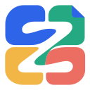

<p align="center">
  
</p>
<h1 align="center">zMatrix</h1>
<p align="center"><strong>One draft. A voice for every platform.</strong><br />A local-first workspace for creators, delivered as a Microsoft Edge extension.</p>
<p align="center">
  <a href="https://github.com/zJay26/zMatrix/actions/workflows/ci.yml"></a>
  <a href="https://github.com/zJay26/zMatrix/releases"></a>
  <a href="LICENSE"></a>
  
</p>
<p align="center">
  <a href="README.md">简体中文</a> · English<br />
  <a href="https://github.com/zJay26/zMatrix/releases">Download preview</a> ·
  <a href="docs/installation.md">Installation (Chinese)</a> ·
  <a href="docs/ROADMAP.md">Roadmap (Chinese)</a> ·
  <a href="https://github.com/zJay26/zMatrix/issues/new/choose">Feedback</a>
</p>

> [!IMPORTANT]
> **v0.1.2 is a developer preview.** Local editing, variants and backups are implemented. None of the 12 real-platform draft/pre-publication acceptance flows have passed yet; live metrics and comments also remain unverified. You always perform the final publication on the platform yourself. See the [acceptance record](docs/acceptance.md).

## Your content, in one workspace

Keep a master draft, tailor titles and content for each platform, prepare image posts, and track the work locally.

**Master draft → platform variants → images and preview → draft / publication preparation → manual publication → registration and tracking**


| Feature | Current implementation |
| --- | --- |
| Writing and import | Markdown editor, files with companion images, pasted text and images |
| Platform variants | Inherited or overridden titles, content and images; change reminders, diffs and snapshots |
| Technical content | Code, tables, LaTeX and Mermaid previews; selected content converted to images as needed |
| Image posts | Three templates, covers, colors, typography and pagination; 1080 × 1440 PNG export |
| Publication preparation | Frozen content, persistent sequential tasks and a manual final publication step |
| Tracking | Registered article links, cached metrics, paginated comments and local read status; live integrations await validation |
| Storage and backup | IndexedDB autosave, ZIP export/restore and backups to an authorized local folder |

<details>
<summary>See the image-post studio</summary>


</details>

Screenshots show the actual local web preview with the built-in sample article. They do not show live platform integration or private account data. Screenshots may be ahead of the published v0.1.2 package. The application UI is currently in Chinese.

## Platform status

Adapter code is not proof of a working platform flow.

| Platform / content type | Save and reopen draft | Complete preparation before final publication | Live metrics / comments |
| --- | --- | --- | --- |
| Zhihu · article | Pending | Pending | Pending |
| Juejin · article | Pending | Pending | Pending |
| CNBlogs · article | Pending | Pending | Pending |
| CSDN · article | Pending | Pending | Pending |
| Xiaohongshu · long article | Pending | Pending | Pending |
| Xiaohongshu · image post | Pending | Pending | Pending |
| LINUX DO | Manual assistance | Manual assistance | Best effort; unverified |

Missing settings completed manually do not count as successful automation. Uncertain results require verification before retrying.

## Get started

1. Download the extension ZIP from [Releases](https://github.com/zJay26/zMatrix/releases), such as `zMatrix-edge-0.1.2.zip`, and extract it to a permanent folder.
2. Open `edge://extensions`, enable **Developer mode**, select **Load unpacked**, and choose the folder containing `manifest.json`.
3. Open **zMatrix** from the browser toolbar. Try the sample article, then connect platforms and configure backups as needed.

For updates, replace the files in the same folder and reload the extension. Preserve its identity and avoid uninstalling it, which may remove local storage. [Detailed installation and recovery guide (Chinese)](docs/installation.md).

## Local-first by design

Content, assets, tasks and caches live in extension IndexedDB. There is no project backend or telemetry. Platform access is requested when connecting each site, using your existing browser session; the tool does not store platform passwords or export cookies.

Pending publication tasks require an explicit resume after reopening the workspace. Backups exclude login information. Restoration merges missing records, preserves existing local records, verifies assets, and pauses unfinished tasks.

## Development

Use **Node.js 24** and the committed lockfile.

```sh
git clone https://github.com/zJay26/zMatrix.git
cd zMatrix
npm ci
npm run preview
```

The web preview runs at `http://127.0.0.1:5173` with separate local data and no extension permissions.

```sh
npm run typecheck
npm test
npm run build       # .output/edge-mv3
npm run package     # checks, build, archives and SHA256
```

Built with WXT, React, TypeScript, Dexie, CodeMirror 6, unified, KaTeX, Mermaid and html-to-image. Edit `public/icon/zmatrix.svg` and run `npm run icons` to regenerate the icon PNGs.

## Contribute

The next milestone is real-platform validation and recovery testing. Cross-device sync, teams, scheduled publication and AI rewriting are outside v1.

Read the [contribution guide](CONTRIBUTING.md), [roadmap](docs/ROADMAP.md) and [changelog](CHANGELOG.md), or submit a [reproducible issue or use case](https://github.com/zJay26/zMatrix/issues/new/choose). These supporting documents are currently in Chinese.

## License and acknowledgments

Original code is licensed under [MIT](LICENSE). Dependencies and referenced implementations retain their own licenses and attribution; see [third-party notices](THIRD_PARTY_NOTICES.md). Thank you to the open-source projects behind the editor, rendering, storage and extension tooling.
