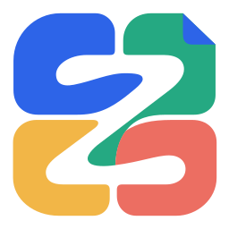
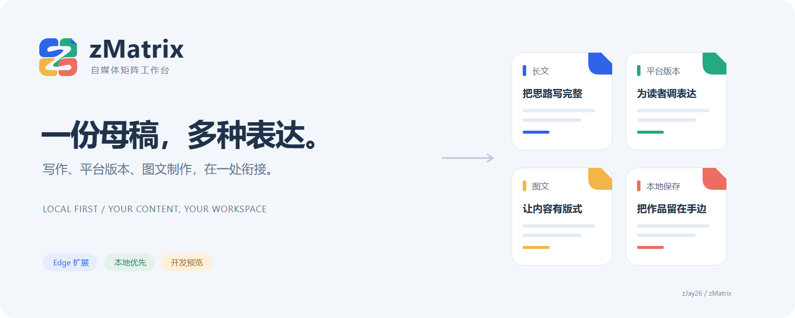
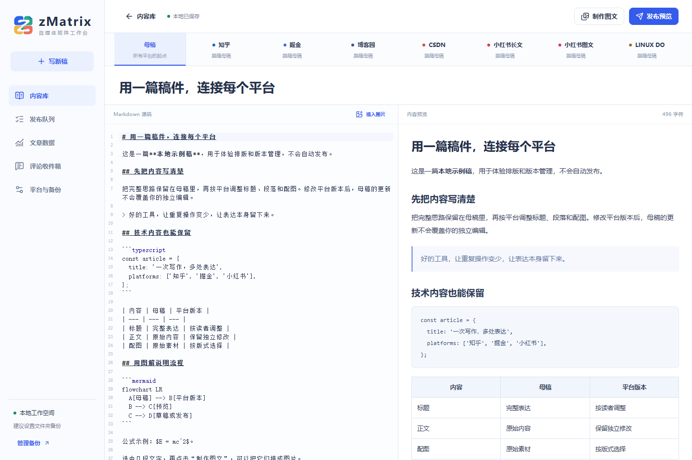
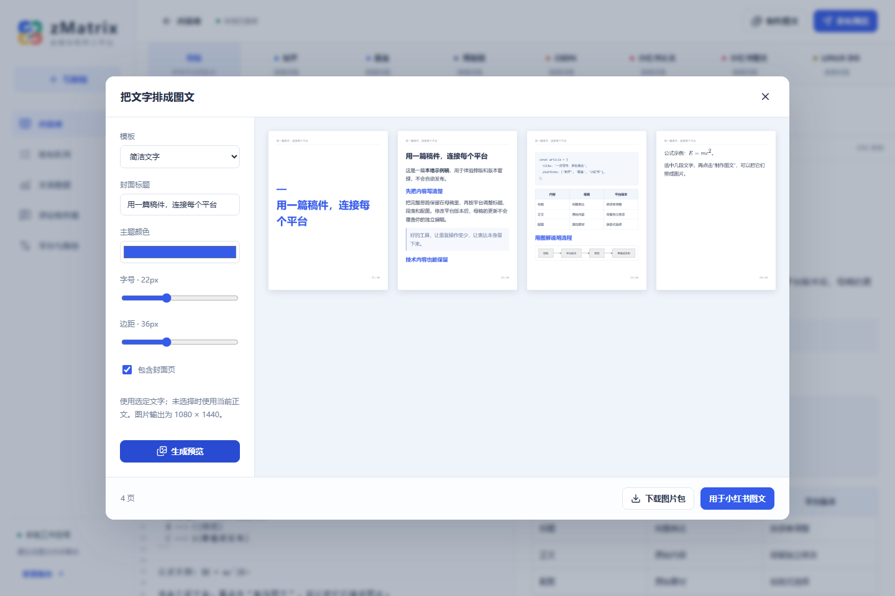

<p align="center">
  <a href="https://github.com/zJay26/zMatrix/releases">
    
  </a>
</p>

<h1 align="center">zMatrix</h1>

<p align="center">
  <strong>写好一份母稿，为不同平台保留各自的表达。</strong><br />
  面向个人创作者的本地内容工作台，以 Microsoft Edge 扩展运行。
</p>

<p align="center">
  <a href="https://github.com/zJay26/zMatrix/actions/workflows/ci.yml"></a>
  <a href="https://github.com/zJay26/zMatrix/releases"></a>
  <a href="LICENSE"></a>
  
  
</p>

<p align="center">
  简体中文 · <a href="README.en.md">English</a><br />
  <a href="https://github.com/zJay26/zMatrix/releases">下载预览版</a> ·
  <a href="docs/installation.md">安装指南</a> ·
  <a href="#界面预览">界面预览</a> ·
  <a href="docs/ROADMAP.md">路线图</a> ·
  <a href="https://github.com/zJay26/zMatrix/issues/new/choose">反馈问题</a>
</p>

> [!IMPORTANT]
> **当前为 v0.1.2 开发预览。** 本地编辑、版本管理与备份已有实现；六条内容路径的 **12 项真实草稿／发布前流程验收尚未通过**，五站指标与评论仍待实测。最终发布始终由你在原站手动完成。详见 [验收记录](docs/acceptance.md)。

## 为什么做 zMatrix

同一篇内容发到多个平台，常常意味着重复排版、修改标题、搬运图片，以及追踪不同版本。zMatrix 把这些工作放在同一个本地空间：保留母稿，针对平台单独调整，需要时再进入原站完成发布。

**一份母稿 → 平台版本 → 图文与预览 → 保存草稿／准备发布 → 手动最终发布 → 登记与跟踪**



## 界面预览

### 母稿与平台版本，在同一处编辑

Markdown 源码、正文预览和各平台版本并排组织。平台版本可以继承母稿，也可以保留独立修改。



### 把文字排成图文

选择简洁文字、技术笔记或图文混排模板，调整封面、主题色、字号与边距，生成多页图片。



<sub>截图来自当前源码的本地网页预览，使用内置示例稿；不连接平台，不包含私人稿件或真实账号数据。截图可能领先于已发布的 v0.1.2 安装包。</sub>

## 工作台能做什么

| 工作 | 当前实现 |
| --- | --- |
| **写作与导入** | 内置 Markdown 编辑器、文件及配套图片目录导入、正文和图片粘贴 |
| **母稿与平台版本** | 标题、正文、配图继承与独立覆盖；母稿变化提醒、版本差异和发布快照 |
| **技术内容排版** | 代码、表格、LaTeX、Mermaid 预览；按平台能力转换部分内容为图片 |
| **制作图文** | 三种模板、封面、配色与分页，输出 1080 × 1440 PNG |
| **发布准备** | 内容预览、冻结版本、持久化串行队列；最终按钮由用户手动点击 |
| **登记与汇总** | 文章链接登记、指标缓存、评论分页与工具内已读状态；真实平台读取待验收 |
| **本地保存与备份** | IndexedDB 自动保存、ZIP 导出与恢复、授权目录自动备份 |

## 平台进度

“已有适配代码”不等于“真实流程已通过”。本地版本编辑可用，远端能力以下表和验收记录为准。

| 平台 / 内容路径 | 草稿保存与重开 | 完整准备至最终发布前 | 真实指标与评论 |
| --- | --- | --- | --- |
| 知乎 · 长文 | 待验收 | 待验收 | 待验收 |
| 掘金 · 长文 | 待验收 | 待验收 | 待验收 |
| 博客园 · 长文 | 待验收 | 待验收 | 待验收 |
| CSDN · 长文 | 待验收 | 待验收 | 待验收 |
| 小红书 · 长文章 | 待验收 | 待验收 | 待验收 |
| 小红书 · 图文笔记 | 待验收 | 待验收 | 待验收 |
| LINUX DO | 人工发布辅助 | 人工发布辅助 | 尽量接入，尚未实测 |

人工补齐缺失设置不计作自动流程通过；结果不确定时先核实，不自动重发。[查看逐项证据 →](docs/acceptance.md)

## 快速开始

1. 从 [Releases](https://github.com/zJay26/zMatrix/releases) 下载预览版扩展 ZIP，例如 `zMatrix-edge-0.1.2.zip`，解压到固定目录。
2. 在 Edge 打开 `edge://extensions`，启用**开发人员模式**，选择**加载解压缩的扩展**。所选目录应直接包含 `manifest.json`。
3. 点击工具栏中的 **zMatrix**，打开工作台；先用示例体验写作与图文制作，再按需连接平台和设置备份。

更新时替换原目录文件并点击**重新加载**，保留扩展身份。完整步骤见 [安装、更新与数据恢复](docs/installation.md)。

## 数据由你掌握

- **本地优先**：稿件、素材、任务和缓存保存在扩展 IndexedDB；无自建服务器或遥测。
- **按需授权**：连接平台时才请求相应站点权限，使用浏览器已有登录状态，不保存平台密码或导出 Cookie。
- **发布由你确认**：停在原站最终发布前；重新打开工作台不会自动继续待发布任务。
- **备份独立保存**：支持文件夹备份和 ZIP 导出。备份不包含平台登录信息，目录授权失效仍可本地编辑。

恢复采用原子合并：已有本地记录优先，补入缺失记录，校验素材，暂停未完成任务。[恢复行为与限制 →](docs/installation.md#备份)

## 本地开发

需要 **Node.js 24**，依赖由 `package-lock.json` 固定。

```sh
git clone https://github.com/zJay26/zMatrix.git
cd zMatrix
npm ci
npm run preview
```

网页预览默认位于 `http://127.0.0.1:5173`，使用独立本地数据，不具备平台扩展权限。

```sh
npm run typecheck  # TypeScript
npm test           # Vitest
npm run build      # .output/edge-mv3
npm run package    # 检查、构建、ZIP 与 SHA256
```

<details>
<summary>技术栈与目录结构</summary>

**WXT · React · TypeScript · Dexie · CodeMirror 6 · unified · KaTeX · Mermaid · html-to-image**

| 目录 | 内容 |
| --- | --- |
| `src/core` | 数据模型、版本关系、内容转换、备份、任务与聚合 |
| `src/platforms` | 能力声明、URL 校验、平台适配与结果核实 |
| `src/entrypoints` | Manifest V3 后台与工作台入口 |
| `src/ui` | 编辑、图文、发布队列、数据、评论和设置 |
| `tests` | 转换、版本、任务、备份、评论与平台保护测试 |
| `public/icon` | 正式图标的 SVG 和各尺寸 PNG |
| `docs` | 安装、验收、路线图与品牌规范 |

`npm run preview:built` 在 `http://127.0.0.1:4173` 预览正式构建，并施加扩展脚本 CSP。网页预览与单元测试均不能替代实际扩展验收。修改图标源文件后运行 `npm run icons`。

</details>

## 路线图与参与

接下来优先完成真实平台草稿／发布前流程、指标与评论读取、异常恢复验收，再收敛 v1。跨设备同步、团队协作、定时发布和 AI 改写不在当前 v1 范围内。

- [路线图](docs/ROADMAP.md)：已实现、正在验证与后续范围。
- [贡献指南](CONTRIBUTING.md)：开发检查、适配边界和数据兼容约定。
- [问题反馈与功能建议](https://github.com/zJay26/zMatrix/issues/new/choose)：欢迎可复现的问题与具体使用场景。
- [更新记录](CHANGELOG.md)：版本变化。

## 许可与致谢

原创代码采用 [MIT License](LICENSE)。第三方依赖及参考实现保留各自许可和署名，详见 [第三方说明](THIRD_PARTY_NOTICES.md)。感谢上述开源组件提供编辑、排版、存储和扩展开发基础。

---

<p align="center"><br /><sub>zMatrix · 把重复操作留给工具，把表达留给自己。</sub></p>
