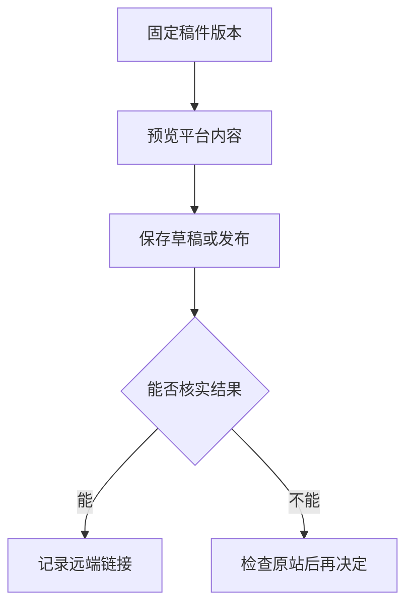

# 技术文章的发布前检查

> 本文由 AI 辅助起草，用于个人技术记录和多平台排版验证。

把一篇技术文章发布到多个平台时，容易遗漏的往往不是正文，而是代码缩进、图片、公式和最后一次修改。下面是一个可以重复使用的检查流程。

## 一、把发布版本固定下来

编辑中的母稿会不断变化，但一次发布任务应绑定确定的内容。任务开始后，即使继续修改母稿，也不应该改变已经排队的版本。

```typescript
type PublishJob = {
  articleId: string;
  revision: number;
  title: string;
  markdown: string;
};

const job = structuredClone(currentArticle);
```

这里的深拷贝只说明“固定版本”的思路。实际应用还需要把任务存到本地数据库，浏览器关闭后才能找回进度。

## 二、检查平台真正收到的内容

| 检查对象 | 发布前           | 发布后               |
| -------- | ---------------- | -------------------- |
| 标题     | 与预览一致       | 详情页能看到完整标题 |
| 正文     | 段落和代码完整   | 重新打开后仍然完整   |
| 图片     | 已上传、顺序正确 | 远端图片可以加载     |
| 状态     | 明确草稿或发布   | 区分审核中和已发布   |

可以用一个表达式描述核对目标：

$$
H(C_{preview}) = H(C_{submitted})
$$

其中，$C$ 表示按同一规则归一化后的内容，$H$ 表示内容摘要。平台可能改变排版，所以不能只比较原始 HTML；图片也需要单独核对。

## 三、结果不确定时，先核实



点击了发布按钮，只能说明执行了一个动作。网络超时后，文章可能已经提交；直接再次点击可能产生重复文章。因此，遇到不确定结果时，先看草稿箱或内容管理页，再决定下一步。

## 四、保留本地备份

本地保存和独立备份是两回事。一次完整备份应包括正文、图片、平台版本和发布记录。恢复后先检查内容，再主动继续未完成的任务。

这套流程的重点是让每次发布可检查、可追溯，也让下一次写作更轻松。
